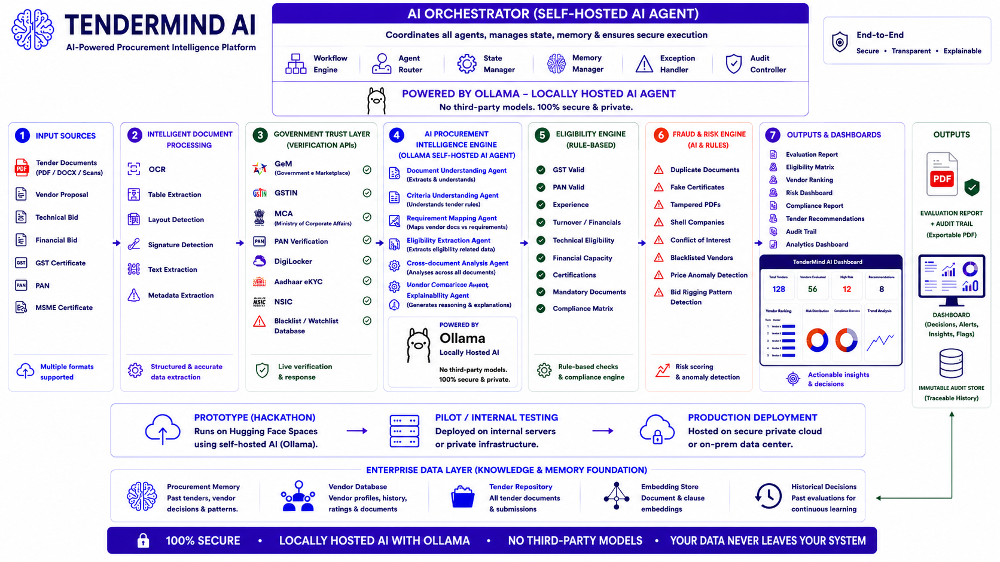
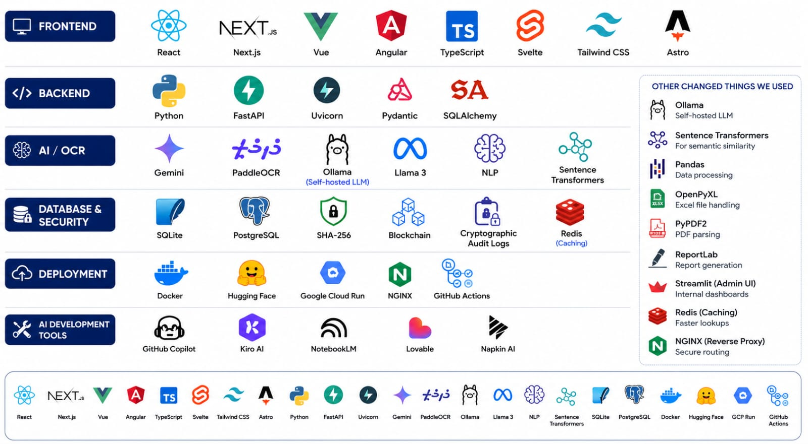

<h1 align="center">
🛡️ TenderMind AI
</h1>

<h3 align="center">
AI-Powered Procurement Intelligence Platform
</h3>

<p align="center">
Secure • Explainable • Self-Hosted • Government Ready
</p>
<div align="center">


</div>

# ⚙️ System Architecture

TenderMind AI follows a secure, modular AI pipeline designed for defence procurement.

<p align="center">
  
</p>

---

# 🚀 Why TenderMind AI?

Government procurement is one of the largest public spending ecosystems.

## 📊 Impact

- 💰 ₹7.85 Lakh Crore Defence Budget
- 🏢 1.5+ Lakh Government Buyers
- 🏭 6.3+ Crore MSMEs
- 📄 Thousands of tenders processed every year

Yet procurement officers still spend **days manually verifying**

- GST
- PAN
- Company Documents
- Technical Specifications
- Eligibility Criteria
- Certificates
- Financial Documents

# ✨ Key Highlights

- 🤖 AI Orchestrator powered by Ollama (Self Hosted)
- 📄 OCR + NLP Document Understanding
- 📑 Automatic Tender Criteria Extraction
- 🏢 Government Verification APIs
- 📊 Vendor Performance & Reliability Score (VPRS)
- ⚠️ Fraud & Risk Detection
- 🛡️ Explainable AI with Human-in-the-Loop
- 🔒 Cryptographic Audit Trail
- ☁️ Government-Ready Deployment

---

# ⚙️ Procurement Workflow

```text
Tender Upload
      │
      ▼
OCR + Document Understanding
      │
      ▼
Criteria Extraction
      │
      ▼
Government Verification APIs
      │
      ▼
Eligibility Engine
      │
      ▼
Vendor Performance Score
      │
      ▼
Fraud Detection
      │
      ▼
Explainable AI Recommendation
      │
      ▼
Human Review
      │
      ▼
Evaluation Report
```

---

# 🚀 Features

✅ AI Tender Understanding

✅ Self Hosted AI (Ollama)

✅ OCR + NLP Pipeline

✅ Automatic Eligibility Verification

✅ Vendor Comparison

✅ Fraud Detection

✅ Explainable AI

✅ Human-in-the-Loop Decision Making

✅ Blockchain Audit Trail

✅ Analytics Dashboard

✅ Exportable Reports

---

# 🛠️ Technology Stack


</p>

---

# 📊 Vendor Performance & Reliability Score (VPRS)

TenderMind AI introduces **Vendor Performance & Reliability Score (VPRS)** to enable transparent and evidence-based procurement.

The score considers:

- 📈 Previous Project Performance
- 📜 Compliance History
- 📑 Certificate Validity
- 💰 Financial Stability
- 🏢 Company Reliability
- 🛠️ Technical Qualification
- 📊 Historical Procurement Performance
- 🚨 Risk Indicators

---

# 🔒 Security & Privacy

TenderMind AI follows a Government-Ready Security Architecture.

- 🔐 Self Hosted AI with Ollama
- 🛡️ No Third-Party LLM Dependency
- 🔑 End-to-End Encryption
- 🔒 SHA-256 Cryptographic Hashing
- 🗄️ PostgreSQL Audit Logs
- ⛓️ Blockchain Audit Trail
- 👨‍💼 Role-Based Access Control
- ✅ Human Approval before every decision

---

# 📈 Business Impact

TenderMind AI helps organizations by

- ⏱️ Reducing Procurement Time
- 📉 Reducing Manual Verification
- 📑 Eliminating Paperwork
- ⚖️ Increasing Transparency
- 🚨 Detecting Fraud
- 🏭 Supporting MSMEs
- 📊 Improving Decision Quality
- 🤝 Building Trust

---

# 📅 Roadmap

| Stage | Status |
|--------|--------|
| 🚀 Prototype | ✅ Completed |
| 🧪 Internal Pilot | 🔄 In Progress |
| 🏛️ Government Pilot | ⏳ Planned |
| 🔗 GeM Integration | ⏳ Planned |
| 🛡️ Defence Deployment | ⏳ Planned |
| 🌍 National Scale | 🎯 Vision |

---

# 📂 Repository Structure

```text
TenderMind-AI
│
├── assets
├── backend
├── frontend
├── docs
├── datasets
├── demo
├── README.md
└── LICENSE
```

---

# 🌍 Future Vision

TenderMind AI is **more than a hackathon project.**

Our long-term vision is to build India's trusted Procurement Intelligence Platform powering transparent procurement across

- 🛡️ Defence
- 🚆 Railways
- 🏢 Public Sector Undertakings
- 🏥 Hospitals
- 🎓 Universities
- 🏙️ Smart Cities
- 🏛️ State Governments

Our mission is simple:

> **Build trust in public procurement through secure, explainable and human-centric AI.**

---

# 🤝 Acknowledgements

We sincerely thank everyone who guided and validated this project, especially the defence experts, procurement professionals, cybersecurity mentors and industry leaders whose insights helped shape TenderMind AI into a stronger and more practical solution.

---

# ⭐ If you like this project

Give this repository a ⭐ and support our mission of building transparent and intelligent public procurement.

---

---

<div align="center">


## ❤️ Team Teen Titans:- CHANDNI VARYANI AND GARGI NAROOKA

Building innovative AI solutions for real-world public sector challenges.

⭐ If you found this project interesting, consider giving this repository a Star!

**Made with ❤️ by Team Teen Titans**

</div>
