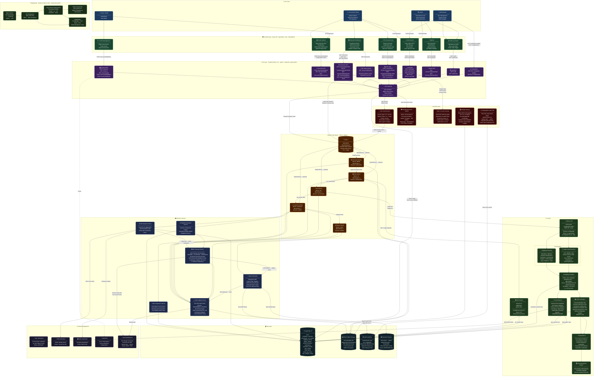

# TenderMind AI — Enterprise System Architecture

```mermaid
flowchart TB

    %% ─────────────────────────────────────────────
    %% USER LAYER
    %% ─────────────────────────────────────────────
    subgraph UL["👥  User Layer"]
        direction LR
        PO["🧑‍💼 Procurement Officer\n─────────────────\nUpload Tenders\nReview Evaluations\nHITL Approval"]
        VN["🏢 Vendor / Bidder\n─────────────────\nSubmit Bids\nView Status"]
        AD["🔧 Administrator\n─────────────────\nUser Management\nSystem Config\nVPRS Weights"]
        AU["🔍 Auditor\n─────────────────\nRead-Only Access\nAudit Log Review\nChain Verification"]
    end

    %% ─────────────────────────────────────────────
    %% FRONTEND LAYER
    %% ─────────────────────────────────────────────
    subgraph FL["🖥️  Frontend Layer  ·  React 18 + TypeScript + Vite + TailwindCSS"]
        direction LR
        AUTH_UI["🔐 Authentication\n─────────────────\nLogin / MFA TOTP\nJWT Storage\nRole Guards\nAuto-Logout on 401"]
        TU["📤 Tender Upload\n─────────────────\nDrag-and-Drop Zone\nFile Browser\nClient-Side 50 MB Guard\nUpload Progress Bar"]
        VM["🏷️ Vendor Management\n─────────────────\nBidder Submissions\nProfile Viewer\nSession Association"]
        ED["📊 Evaluation Dashboard\n─────────────────\nCompliance Matrix\nVPRS Score Cards\nFraud Alert Panel\nPipeline Progress SSE"]
        RPT["📄 Reports\n─────────────────\nPDF Download\nJSON Export\nApproval Status\nTop Bidder Highlight"]
        HITL_UI["✅ HITL Review Panel\n─────────────────\nCriterion Override\nJustification Input\n30-min Countdown Gate\nApproval / Rejection"]
        AUDIT_UI["📋 Audit Log Viewer\n─────────────────\nPaginated Log Table\nDate / Actor Filter\nChain Verify Trigger"]
    end

    %% ─────────────────────────────────────────────
    %% API LAYER
    %% ─────────────────────────────────────────────
    subgraph AL["⚡  API Layer  ·  FastAPI Python 3.11  ·  /api/v1/  ·  OpenAPI at /api/v1/docs"]
        direction TB
        GW["🚪 API Gateway\n─────────────────\nJWT Validation\nRBAC Enforcement\nRate Limiting\nRequest ID Injection"]
        AUTH_API["🔑 Auth APIs\nPOST /auth/login\nPOST /auth/refresh\nPOST /auth/logout\nGET /users\nPATCH /users/{id}"]
        DOC_API["📁 Document APIs\nPOST /documents/upload\nGET /documents/{id}\nGET /documents/{id}/download"]
        SESSION_API["🗂️ Session APIs\nPOST /sessions\nGET /sessions\nGET /sessions/{id}\nPOST /sessions/{id}/bidders\nPOST /sessions/{id}/start"]
        EVAL_API["📈 Evaluation APIs\nGET /sessions/{id}/criteria\nPATCH /sessions/{id}/criteria/{cid}\nGET /sessions/{id}/evaluation\nGET /sessions/{id}/vprs\nGET /sessions/{id}/fraud-alerts"]
        HITL_API["✍️ HITL APIs\nPOST /review/start\nPATCH /review/results/{id}\nPOST /review/acknowledge-alerts\nPOST /review/approve\nPOST /review/reject"]
        REPORT_API["📑 Report APIs\nGET /sessions/{id}/report/pdf\nGET /sessions/{id}/report/json"]
        AUDIT_API["🔒 Audit APIs\nGET /audit\nGET /audit/verify"]
        CONFIG_API["⚙️ Config APIs\nGET/PUT /config/vprs-weights\nGET/PUT /config/ollama"]
        SSE_API["📡 SSE Status Stream\nGET /sessions/{id}/status\n─────────────────\nReal-time pipeline events\nHeartbeat every ≤5s"]
    end

    %% ─────────────────────────────────────────────
    %% ASYNC TASK QUEUE
    %% ─────────────────────────────────────────────
    subgraph TQ["⚙️  Async Task Queue  ·  Celery + Redis 7"]
        direction LR
        RD_QUEUE[("🔴 Redis 7\n─────────────────\nTask Broker\nResult Backend\nPub/Sub SSE Channel\nRefresh Token Store\nTTL: 7 days")]
        W_DOC["📥 Document Worker\nQueue: default\nMax Retries: 3\nBackoff: 5s/25s/125s"]
        W_OCR["🖼️ OCR Worker\nQueue: ocr\nMax Retries: 3\nBackoff: 10s/50s/250s"]
        W_NLP["🧠 NLP Worker\nQueue: nlp\nMax Retries: 3\nBackoff: 15s/75s/375s"]
        W_EVAL["⚖️ Evaluation Worker\nQueue: evaluation\nMax Retries: 2\nBackoff: 10s/60s"]
        W_RPT["📋 Report Worker\nQueue: report\nMax Retries: 2\nBackoff: 10s/60s"]
    end

    %% ─────────────────────────────────────────────
    %% AI LAYER
    %% ─────────────────────────────────────────────
    subgraph AIL["🤖  AI Layer"]
        direction TB
        OCR_ENG["🖼️ OCR Engine\n─────────────────\nTesseract 5\npdfplumber\npython-docx\n─────────────────\nConfidence Score 0–1\nFlag < 0.75\nStructure Preservation"]
        OLLAMA["🦙 Ollama LLM\n─────────────────\nSelf-Hosted\nConfigurable Model\nREST API :11434\n─────────────────\nTimeout: configurable\nRetry: 3× exponential\nAir-Gapped: No ext. calls"]

        subgraph NLP_PIPE["NLP Pipeline"]
            direction TB
            NLP_CRIT["📝 Eligibility Extraction\n─────────────────\nMandatory / Optional\nKeyword Classification\nThreshold + Unit Parsing\nEnglish + Hindi Support\nFlag confidence < 0.80"]
            NLP_BID["🏷️ Bidder Data Extraction\n─────────────────\nGST / MSME / PAN\nAnnual Turnover (INR Crore)\nYears Experience\nCertifications\nClient References"]
        end

        ELIG["⚖️ Eligibility Evaluator\n─────────────────\nPASS / FAIL / PARTIAL\nMandatory Fail → INELIGIBLE\nScore = MandatoryPass×70\n       + OptionalPass×30\n20 bidders × 30 criteria\nin ≤ 120 seconds"]
        VPRS["📊 VPRS Calculator\n─────────────────\nFinancial Stability 25%\nRelevant Experience 25%\nCertification Validity 20%\nCompliance Complete 15%\nHistorical Performance 15%\nAdmin-Configurable Weights\nRanked 0–100"]
        FRAUD["🚨 Fraud Detector\n─────────────────\nMinHash Near-Duplicate\nGST Regex Validation\nFinancial Cross-Validation\nCert Expiry / Near-Expiry\nImplausible Financials\nSeverity: LOW/MEDIUM/HIGH"]
        XAI["💡 Explainable AI\n─────────────────\nPer-Criterion Evidence\nAI Confidence Levels\nVPRS Component Breakdown\nFraud Alert Descriptions\nTop Bidder Justification"]
        RECOM["🏆 Recommendation Engine\n─────────────────\nDescending VPRS Ranking\nTop Bidder Highlight\nHuman-Readable Rationale"]
    end

    %% ─────────────────────────────────────────────
    %% BUSINESS SERVICES
    %% ─────────────────────────────────────────────
    subgraph BS["🏛️  Business Services"]
        direction LR
        SVC_ELIG["⚖️ Eligibility Evaluation Service\n─────────────────\nCriterion Comparison Engine\nCompliance Matrix Builder\nIneligibility Enforcer"]
        SVC_BID["🔁 Bid Comparison Service\n─────────────────\nMulti-Bidder Normalization\nMonetary Unit Conversion\nCross-Bidder Matrix View"]
        SVC_RISK["⚠️ Risk Analysis Service\n─────────────────\nFraud Score Aggregation\nAlert Escalation Logic\nHIGH Alert Finalization Block"]
        SVC_HITL["👁️ HITL Review Service\n─────────────────\nState Machine Orchestration\nPENDING→IN_REVIEW→APPROVED\n30-Minute Gate Enforcement\nHIGH Alert Acknowledgment Gate\nJustification Validator ≥10 chars\nIn-Platform Notifications"]
        SVC_AUDIT["📜 Audit Logging Service\n─────────────────\nSHA-256 Hash Chain\nGenesis: TENDERMIND_GENESIS\nAll 10 Event Types\nToken Counts Only for LLM\nVerification Endpoint\n7-Year Retention Policy"]
        RPT_GEN["📑 Report Generator\n─────────────────\nWeasyPrint PDF\nJinja2 HTML Template\nJSON Structured Export\nSHA-256 Hash in Audit\nPost-HITL Approval Only"]
    end

    %% ─────────────────────────────────────────────
    %% SECURITY LAYER
    %% ─────────────────────────────────────────────
    subgraph SEC["🔐  Security Layer"]
        direction LR
        JWT_SEC["🔑 JWT Authentication\n─────────────────\nAccess Token TTL: 8 hours\nRefresh Token TTL: 7 days\nHS256 / RS256\nRevocable via Redis\nAuto-Logout on Expiry"]
        RBAC["🛡️ Role-Based Access Control\n─────────────────\nAdmin: All Permissions\nProcurement Officer:\n  Upload · Evaluate · HITL\nAuditor:\n  Read Logs · Read Reports\nHTTP 403 on Violation"]
        MFA["🔐 MFA / Account Security\n─────────────────\nTOTP RFC 6238 via pyotp\nMandatory for Admin Role\nbcrypt Cost Factor 12\nLockout after 5 Failures\nAdmin Alert on Lock"]
        CRYPTO["🔗 Cryptographic Audit Trail\n─────────────────\nSHA-256 Linked Hash Chain\nAppend-Only Log\nTamper Alert → Admin\nPayload Hash per Entry\nChain Hash Verification API"]
        STORAGE_SEC["🗄️ Storage Security\n─────────────────\nMinIO SSE-S3 Encryption\nTLS 1.2+ at Ingress\nEnv-Managed DB Credentials\nPydantic Input Validation\nNo Raw LLM Prompts Logged"]
    end

    %% ─────────────────────────────────────────────
    %% DATA LAYER
    %% ─────────────────────────────────────────────
    subgraph DL["🗄️  Data Layer"]
        direction LR
        PG[("🐘 PostgreSQL 15\n─────────────────\nusers\nevaluation_sessions\ndocuments  ·  ocr_results\neligibility_criteria\nbidder_profiles\nannual_turnovers\ncertifications\nevaluation_results\nvprs_results\nfraud_alerts\naudit_log_entries\nvprs_weights_config")]
        MINIO[("📦 MinIO Object Storage\n─────────────────\nS3-Compatible API\nOriginal Document Binaries\nPDF Report Archives\n7-Year Cold Archive\nSSE-S3 Encryption")]
        AUDIT_DB[("🔒 Audit Log Store\n─────────────────\nPartitioned by Year\nHot: PostgreSQL\nWarm/Cold: MinIO Archive\nBigSerial Primary Key\nChain Hash per Row")]
        EVAL_STORE[("📊 Evaluation Reports\n─────────────────\nPDF Binary → MinIO\nJSON Structured → PostgreSQL\nSHA-256 Hash in Audit\nAccess: APPROVED only")]
    end

    %% ─────────────────────────────────────────────
    %% EXTERNAL INTEGRATIONS
    %% ─────────────────────────────────────────────
    subgraph EXT["🌐  External Integrations"]
        direction LR
        GST["🏦 GST Verification\n─────────────────\nFormat Regex Validation\n15-char Pattern Check\nFuture: GSTN API"]
        PAN["🪪 PAN Verification\n─────────────────\nVendor Identity Check\nFuture: Income Tax API"]
        MCA["🏛️ MCA Verification\n─────────────────\nCompany Registration\nFuture: MCA21 API"]
        GEM["🛒 GeM APIs\n─────────────────\nGovt e-Marketplace\nFuture Integration\nCatalog Sync"]
        EMAIL["📧 Email Notifications\n─────────────────\nHITL Ready for Review\nAccount Lock Alert\nTamper Alert → Admin\nFuture: SMTP / SES"]
    end

    %% ─────────────────────────────────────────────
    %% DEPLOYMENT LAYER
    %% ─────────────────────────────────────────────
    subgraph DEPLOY["🚀  Deployment  ·  Docker Compose (dev) · Kubernetes (prod)"]
        direction LR
        K8S_API["API Deployment\nHPA: CPU 70%\nMin 2 → Max 10 replicas"]
        K8S_W["Celery Worker Deployments\nPer-Queue Scaling\ndefault · ocr · nlp\nevaluation · report"]
        K8S_AI["Ollama StatefulSet\nGPU Node Pool\nModel Preloaded via initContainer"]
        K8S_DB["StatefulSets\nPostgreSQL + PVC\nRedis + PVC\nMinIO Distributed + PVC"]
        K8S_ING["Nginx Ingress\nTLS Termination\n/ → Frontend\n/api/v1/ → API"]
    end

    %% ═══════════════════════════════════════════════
    %% DATA FLOW CONNECTIONS
    %% ═══════════════════════════════════════════════

    %% Users → Frontend
    PO -->|"HTTPS Browser"| AUTH_UI
    PO --> TU
    PO --> ED
    PO --> HITL_UI
    VN -->|"HTTPS Browser"| TU
    VN --> VM
    AD -->|"HTTPS Browser"| AUTH_UI
    AD --> AUDIT_UI
    AU -->|"HTTPS Browser"| AUTH_UI
    AU --> AUDIT_UI
    AU --> RPT

    %% Frontend → API (REST + SSE)
    AUTH_UI -->|"POST /auth/login\nPOST /auth/refresh"| AUTH_API
    TU -->|"POST /documents/upload\nmultipart/form-data"| DOC_API
    VM -->|"POST /sessions/{id}/bidders"| SESSION_API
    ED -->|"GET /evaluation\nGET /vprs\nGET /fraud-alerts"| EVAL_API
    ED -->|"SSE subscription"| SSE_API
    HITL_UI -->|"PATCH /review/results\nPOST /review/approve"| HITL_API
    RPT -->|"GET /report/pdf\nGET /report/json"| REPORT_API
    AUDIT_UI -->|"GET /audit\nGET /audit/verify"| AUDIT_API
    AD -->|"PUT /config/vprs-weights\nPUT /config/ollama"| CONFIG_API

    %% API Gateway routing
    AUTH_API --> GW
    DOC_API --> GW
    SESSION_API --> GW
    EVAL_API --> GW
    HITL_API --> GW
    REPORT_API --> GW
    AUDIT_API --> GW
    CONFIG_API --> GW
    SSE_API --> GW

    %% API → Security enforcement
    GW -->|"JWT decode\nRBAC check"| JWT_SEC
    GW -->|"Role permission check"| RBAC
    AUTH_API -->|"bcrypt verify\nTOTP verify\nLockout check"| MFA

    %% API → Task Queue
    GW -->|"Enqueue pipeline chain"| RD_QUEUE

    %% Task Queue → Workers (pipeline chain)
    RD_QUEUE -->|"Dequeue tasks"| W_DOC
    W_DOC -->|"ingest_document done"| W_OCR
    W_OCR -->|"ocr_extract done"| W_NLP
    W_NLP -->|"nlp_extract done"| W_EVAL
    W_EVAL -->|"evaluate done"| W_RPT

    %% Workers → AI Services
    W_OCR -->|"PDF / image dispatch"| OCR_ENG
    W_NLP -->|"tender text\nbidder text"| OLLAMA
    OLLAMA --> NLP_CRIT
    OLLAMA --> NLP_BID
    NLP_CRIT --> ELIG
    NLP_BID --> ELIG
    ELIG --> VPRS
    ELIG --> FRAUD
    VPRS --> XAI
    FRAUD --> XAI
    XAI --> RECOM

    %% Workers → Business Services
    W_DOC --> SVC_AUDIT
    W_OCR --> SVC_AUDIT
    W_NLP --> SVC_AUDIT
    W_EVAL --> SVC_ELIG
    W_EVAL --> SVC_BID
    W_EVAL --> SVC_RISK
    W_EVAL --> SVC_AUDIT
    W_RPT --> RPT_GEN
    W_RPT --> SVC_AUDIT

    %% Business Services → HITL
    SVC_RISK -->|"HIGH alert → block finalization"| SVC_HITL
    SVC_ELIG --> SVC_HITL
    SVC_HITL -->|"APPROVED → trigger report"| RPT_GEN
    SVC_HITL --> SVC_AUDIT

    %% Business Services → Data Layer
    SVC_ELIG --> PG
    SVC_BID --> PG
    SVC_RISK --> PG
    SVC_AUDIT -->|"Append audit entry\nSHA-256 chain"| AUDIT_DB
    RPT_GEN -->|"Store PDF binary"| MINIO
    RPT_GEN -->|"Store JSON report"| EVAL_STORE
    RPT_GEN -->|"SHA-256 hash → audit"| SVC_AUDIT

    %% AI Layer → Data Layer
    OCR_ENG -->|"ocr_results rows"| PG
    ELIG -->|"evaluation_results rows"| PG
    VPRS -->|"vprs_results rows"| PG
    FRAUD -->|"fraud_alerts rows"| PG

    %% Workers → SSE / Data Layer
    W_DOC --> MINIO
    W_OCR --> MINIO
    W_DOC -->|"PipelineEvent → pub/sub"| RD_QUEUE
    W_OCR -->|"PipelineEvent → pub/sub"| RD_QUEUE
    W_NLP -->|"PipelineEvent → pub/sub"| RD_QUEUE
    W_EVAL -->|"PipelineEvent → pub/sub"| RD_QUEUE
    SSE_API -->|"Subscribe pub/sub\nStream to browser ≤5s"| RD_QUEUE

    %% Security → Data Layer
    JWT_SEC -->|"Refresh token store / revoke"| RD_QUEUE
    CRYPTO -->|"Hash chain entries"| AUDIT_DB
    STORAGE_SEC --> MINIO

    %% API → Data Layer (direct reads)
    GW -->|"Direct reads\n(non-AI ops ≤500ms)"| PG

    %% External Integrations
    FRAUD -->|"GST format check"| GST
    SVC_RISK -->|"PAN cross-check"| PAN
    SVC_RISK -->|"Company registry"| MCA
    SVC_HITL -->|"Review ready alert\nAccount lock alert"| EMAIL
    SVC_AUDIT -->|"Tamper alert"| EMAIL
    SESSION_API -.->|"Future"| GEM

    %% Deployment
    K8S_ING --> K8S_API
    K8S_API --> K8S_W
    K8S_W --> K8S_AI
    K8S_API --> K8S_DB
    K8S_W --> K8S_DB

    %% ─────────────────────────────────────────────
    %% STYLES
    %% ─────────────────────────────────────────────
    classDef userNode fill:#1e3a5f,stroke:#4a90d9,color:#ffffff,rx:8
    classDef frontendNode fill:#1a4731,stroke:#34d399,color:#ffffff,rx:8
    classDef apiNode fill:#3b1f5e,stroke:#a78bfa,color:#ffffff,rx:8
    classDef queueNode fill:#4a2000,stroke:#fb923c,color:#ffffff,rx:8
    classDef aiNode fill:#1f3a1f,stroke:#86efac,color:#ffffff,rx:8
    classDef businessNode fill:#1f2a4a,stroke:#60a5fa,color:#ffffff,rx:8
    classDef secNode fill:#3b0a0a,stroke:#f87171,color:#ffffff,rx:8
    classDef dataNode fill:#0f2027,stroke:#94a3b8,color:#ffffff,rx:8
    classDef extNode fill:#1a1a2e,stroke:#c084fc,color:#ffffff,rx:8
    classDef deployNode fill:#1a2e1a,stroke:#4ade80,color:#ffffff,rx:8

    class PO,VN,AD,AU userNode
    class AUTH_UI,TU,VM,ED,RPT,HITL_UI,AUDIT_UI frontendNode
    class GW,AUTH_API,DOC_API,SESSION_API,EVAL_API,HITL_API,REPORT_API,AUDIT_API,CONFIG_API,SSE_API apiNode
    class RD_QUEUE,W_DOC,W_OCR,W_NLP,W_EVAL,W_RPT queueNode
    class OCR_ENG,OLLAMA,NLP_CRIT,NLP_BID,ELIG,VPRS,FRAUD,XAI,RECOM aiNode
    class SVC_ELIG,SVC_BID,SVC_RISK,SVC_HITL,SVC_AUDIT,RPT_GEN businessNode
    class JWT_SEC,RBAC,MFA,CRYPTO,STORAGE_SEC secNode
    class PG,MINIO,AUDIT_DB,EVAL_STORE dataNode
    class GST,PAN,MCA,GEM,EMAIL extNode
    class K8S_API,K8S_W,K8S_AI,K8S_DB,K8S_ING deployNode
```
