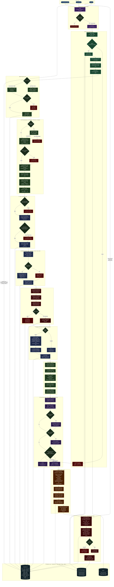

# TenderMind AI — Complete Workflow Flowchart

```mermaid
flowchart TD

    %% ─────────────────────────────────────────────
    %% USER LAYER
    %% ─────────────────────────────────────────────
    subgraph USER["👥 User Layer"]
        PO([🧑‍💼 Procurement Officer])
        AD([🔧 Administrator])
        AU([🔍 Auditor])
    end

    %% ─────────────────────────────────────────────
    %% AUTHENTICATION LAYER
    %% ─────────────────────────────────────────────
    subgraph AUTH["🔐 Authentication & Access Control"]
        LOGIN["Login\nUsername + Password + TOTP MFA"]
        RBAC{"RBAC Check\nRole Permitted?"}
        JWT["Issue JWT\nAccess 8h · Refresh 7d"]
        DENY["❌ HTTP 403 Denied"]
    end

    %% ─────────────────────────────────────────────
    %% DOCUMENT INGESTION LAYER
    %% ─────────────────────────────────────────────
    subgraph INGEST["📤 Document Ingestion Layer"]
        UPLOAD["Tender Upload\nPDF · DOCX · JPEG · PNG · TIFF"]
        VALIDATE{"Validate\nFormat & Size ≤ 50 MB?"}
        REJECT["❌ Reject Upload\nError: format / size"]
        STORE["Store to MinIO\nSSE-S3 Encrypted"]
        UPLOAD_BID["Bidder Submissions Upload\n1 to 20 bidders"]
        SESSION["Create Evaluation Session\nAssociate tender + bidder docs"]
        START["Start Pipeline\nEnqueue Celery Chain → Redis"]
    end

    %% ─────────────────────────────────────────────
    %% OCR LAYER
    %% ─────────────────────────────────────────────
    subgraph OCR_LAYER["🖼️ OCR Engine Layer"]
        DOC_TYPE{"Document Type?"}
        NATIVE["Native PDF / DOCX\npdfplumber · python-docx\nDirect text extract"]
        SCANNED["Scanned PDF / Image\nTesseract 5\nOCR extract"]
        CONFIDENCE{"Page Confidence\n≥ 0.75?"}
        FLAG_OCR["⚠️ Flag Page\nNotify Officer\nManual review"]
        OCR_DONE["OCR Complete\nStructured text\nheadings · tables · lists"]
    end

    %% ─────────────────────────────────────────────
    %% NLP LAYER
    %% ─────────────────────────────────────────────
    subgraph NLP_LAYER["🧠 NLP Processing Layer  ·  Ollama LLM  ·  Self-Hosted · Air-Gapped"]
        LLM_AVAIL{"Ollama LLM\nAvailable?"}
        LLM_RETRY["⏳ Retry Exponential\n15s → 75s → 375s\nMax 3 attempts"]
        LLM_FAIL["❌ LLM Unavailable\nSurface error to session"]
        CRIT_EXTRACT["Eligibility Extraction\nExtract criteria from tender\ntype · threshold · unit · operator\nEnglish + Hindi support"]
        CRIT_CONF{"Criterion Confidence\n≥ 0.80?"}
        FLAG_CRIT["⚠️ Flag Criterion\nManual entry required"]
        CLASSIFY["Classify Criterion Type\nMANDATORY / required → mandatory\nOPTIONAL / preference → optional"]
        OFFICER_REVIEW["Officer Reviews Criteria\nConfirm · Correct flagged items"]
        BID_EXTRACT["Bidder Data Extraction\nCompany · GST · PAN · MSME\nTurnover · Experience\nCertifications · Client refs"]
        NORMALIZE["Normalize Data\nMonetary → INR Crore 2 d.p.\nAbsent fields → null"]
    end

    %% ─────────────────────────────────────────────
    %% VENDOR VERIFICATION LAYER
    %% ─────────────────────────────────────────────
    subgraph VENDOR_LAYER["🏷️ Vendor Verification Layer"]
        GST_CHECK{"GST Format Valid?\n15-char regex check"}
        GST_ALERT["⚠️ GST Format Alert\nfraud_alert: gst_invalid"]
        PAN_MCA["PAN + MCA Verification\nCompany registration check\nFuture: Income Tax + MCA21 APIs"]
        CERT_CHECK{"Certifications\nExpired or Near-Expiry\nwithin 90 days?"}
        CERT_ALERT["⚠️ Certification Alert\nfraud_alert: cert_expired"]
        VENDOR_PROFILE["Vendor Profile Complete\nStructured BidderProfile JSON\nstored in DB"]
    end

    %% ─────────────────────────────────────────────
    %% ELIGIBILITY EVALUATION LAYER
    %% ─────────────────────────────────────────────
    subgraph ELIG_LAYER["⚖️ Eligibility Evaluation Layer  ·  Pure Python · No LLM · SLA ≤ 120s"]
        COMPARE["Compare Each Bidder\nvs Every Criterion\nPASS · FAIL · PARTIAL\n+ evidence quote"]
        MAND_FAIL{"Any Mandatory\nCriterion FAIL?"}
        INELIGIBLE["Mark INELIGIBLE\neligibility_score = 0\nvprs_score = 0"]
        ELIG_SCORE["Compute Eligibility Score\n= mandatory_pass × 70\n+ optional_pass × 30\nRange: 0 – 100"]
        MATRIX["Build Compliance Matrix\nAll bidders × All criteria\nSortable dashboard view"]
    end

    %% ─────────────────────────────────────────────
    %% FRAUD DETECTION LAYER
    %% ─────────────────────────────────────────────
    subgraph FRAUD_LAYER["🚨 Fraud Detection Layer"]
        DEDUP["Near-Duplicate Detection\nMinHash · Jaccard ≥ 0.85\nwithin same session"]
        FINANCIAL["Financial Cross-Validation\nDeclared turnover vs\nCA cert · balance sheet"]
        IMPLAUSIBLE["Implausible Financials\nStatistical deviation from\nindustry benchmarks"]
        SEVERITY{"Alert Severity?"}
        LOW_MED["⚠️ LOW / MEDIUM Alert\nRecorded · Visible in dashboard"]
        HIGH_ALERT["🔴 HIGH Alert\nBlock finalization\nMandatory HITL acknowledgment"]
    end

    %% ─────────────────────────────────────────────
    %% VPRS LAYER
    %% ─────────────────────────────────────────────
    subgraph VPRS_LAYER["📊 Vendor Performance and Reliability Score Layer"]
        VPRS_CHECK{"Bidder\nEligible?"}
        VPRS_ZERO["VPRS = 0\nSkip component calc\nIneligible bidder"]
        VPRS_CALC["VPRS Calculation\nFinancial Stability  25%\nRelevant Experience  25%\nCertification Validity  20%\nCompliance Completeness  15%\nHistorical Performance  15%"]
        VPRS_EXPLAIN["Generate Explanation\nPer-component contribution\nNarrative for each bidder"]
        VPRS_RANK["Rank Bidders\nDescending VPRS order\nRank 1 = highest scorer"]
    end

    %% ─────────────────────────────────────────────
    %% EXPLAINABLE AI LAYER
    %% ─────────────────────────────────────────────
    subgraph XAI_LAYER["💡 Explainable AI Layer"]
        XAI_CRIT["Per-Criterion Evidence\nAI verdict + evidence quote\nfrom source document"]
        XAI_CONF["AI Confidence Levels\nPer decision: 0.000 – 1.000"]
        XAI_VPRS["VPRS Component Breakdown\nWeighted score per component\nAdmin-configurable weights"]
        XAI_FRAUD["Fraud Alert Descriptions\nSeverity · type · evidence fields"]
        XAI_TOP["Top Bidder Justification\nHuman-readable rationale\nfor rank 1 recommendation"]
    end

    %% ─────────────────────────────────────────────
    %% HUMAN REVIEW LAYER
    %% ─────────────────────────────────────────────
    subgraph HITL_LAYER["✅ Human Review Layer  ·  HITL Workflow  ·  Min 30-minute gate"]
        NOTIFY["Notify Procurement Officer\nIn-platform notification\nEvaluation ready for review"]
        OPEN_REVIEW["Officer Opens Review\nStatus → IN_REVIEW\nreview_started_at = NOW()"]
        ACK_HIGH{"HIGH Fraud Alert\nPresent?"}
        ACK_ALERT["Acknowledge HIGH Alert\nOfficer must explicitly act\nbefore approving"]
        OVERRIDE{"Officer Overrides\nAI Verdict?"}
        JUSTIFY["Enter Justification\nMin 10 characters required\nRecorded in audit log"]
        GATE{"30-min Review Gate\nElapsed since\nevaluation_completed_at?"}
        WAIT["⏳ Wait\nRemaining time shown\nin countdown UI"]
        APPROVE["✅ Approve Evaluation\nStatus → APPROVED\napproved_by · approved_at"]
        REJECT["❌ Reject Evaluation\nStatus → REJECTED\nRejection reason recorded"]
    end

    %% ─────────────────────────────────────────────
    %% REPORT LAYER
    %% ─────────────────────────────────────────────
    subgraph REPORT_LAYER["📑 Evaluation Report Layer"]
        GEN_PDF["Generate PDF Report\nWeasyPrint · Jinja2 template\n──────────────────\nBidder summary table\nCompliance detail + evidence\nVPRS component breakdowns\nFraud alerts list\nAI confidence per decision\nApproving officer name + role\nTop bidder highlight"]
        GEN_JSON["Generate JSON Report\nMachine-readable export\nMirrors PDF structure"]
        HASH_RPT["Compute SHA-256 Hashes\npdf_sha256 · json_sha256\nStored with report record"]
        STORE_RPT["Store Reports\nMinIO: tendermind-reports\nPDF binary · JSON export"]
        DOWNLOAD["Officer Downloads Report\nGET /report/pdf\nGET /report/json\nPost-approval gate enforced"]
    end

    %% ─────────────────────────────────────────────
    %% AUDIT LAYER
    %% ─────────────────────────────────────────────
    subgraph AUDIT_LAYER["📜 Audit Logs Layer  ·  Cryptographic Hash Chain"]
        AUDIT_EVENT["Record Audit Event\nFor every significant action:\ndoc upload · OCR · NLP · eval\nVPRS · fraud · HITL · report · auth\nLLM invocations: token counts only"]
        CHAIN["Build Hash Chain Entry\npayload_hash = SHA-256 event_payload\nchain_hash = SHA-256 prev_chain || payload\nAppend-only · tamper-evident"]
        VERIFY{"Verify\nHash Chain?"}
        CHAIN_OK["✅ Chain Valid\nN entries verified"]
        TAMPER["🔴 Tamper Alert\nNotify all Admin users\nEmail + in-platform"]
        ARCHIVE["Archive Policy\nHot: PostgreSQL\nCold: MinIO after 7 years\n7-year retention minimum"]
    end

    %% ─────────────────────────────────────────────
    %% DATABASE LAYER
    %% ─────────────────────────────────────────────
    subgraph DB_LAYER["🗄️ Database Layer  ·  PostgreSQL 15  ·  MinIO Object Storage  ·  Redis 7"]
        PG[("PostgreSQL 15\n──────────────────\nusers · roles · permissions\nevaluation_sessions\ndocuments · ocr_results\ntender_criteria\nbidder_profiles\nevaluation_results\nvprs_results · fraud_alerts\naudit_log_entries\nreports · vprs_weights_config")]
        MINIO[("MinIO Object Storage\n──────────────────\ntendermind-documents\ntendermind-reports\ntendermind-audit-cold\nSSE-S3 Encrypted")]
        REDIS[("Redis 7\n──────────────────\nCelery task queue\nSSE pub/sub channel\nRefresh token store")]
    end

    %% ═══════════════════════════════════════════════
    %% MAIN FLOW CONNECTIONS
    %% ═══════════════════════════════════════════════

    %% User → Auth
    PO --> LOGIN
    AD --> LOGIN
    AU --> LOGIN
    LOGIN --> RBAC
    RBAC -->|"Yes — role permitted"| JWT
    RBAC -->|"No"| DENY
    JWT --> UPLOAD

    %% Ingest
    UPLOAD --> VALIDATE
    VALIDATE -->|"Invalid"| REJECT
    VALIDATE -->|"Valid"| STORE
    STORE --> UPLOAD_BID
    UPLOAD_BID --> SESSION
    SESSION --> START
    START --> DOC_TYPE

    %% OCR
    DOC_TYPE -->|"Native PDF / DOCX"| NATIVE
    DOC_TYPE -->|"Scanned PDF / Image"| SCANNED
    NATIVE --> CONFIDENCE
    SCANNED --> CONFIDENCE
    CONFIDENCE -->|"< 0.75"| FLAG_OCR
    CONFIDENCE -->|"≥ 0.75"| OCR_DONE
    FLAG_OCR --> OCR_DONE

    %% NLP
    OCR_DONE --> LLM_AVAIL
    LLM_AVAIL -->|"No"| LLM_RETRY
    LLM_RETRY -->|"Max retries exceeded"| LLM_FAIL
    LLM_RETRY -->|"LLM recovered"| CRIT_EXTRACT
    LLM_AVAIL -->|"Yes"| CRIT_EXTRACT
    CRIT_EXTRACT --> CRIT_CONF
    CRIT_CONF -->|"< 0.80"| FLAG_CRIT
    CRIT_CONF -->|"≥ 0.80"| CLASSIFY
    FLAG_CRIT --> CLASSIFY
    CLASSIFY --> OFFICER_REVIEW
    OFFICER_REVIEW --> BID_EXTRACT
    BID_EXTRACT --> NORMALIZE

    %% Vendor Verification
    NORMALIZE --> GST_CHECK
    GST_CHECK -->|"Invalid"| GST_ALERT
    GST_CHECK -->|"Valid"| PAN_MCA
    GST_ALERT --> PAN_MCA
    PAN_MCA --> CERT_CHECK
    CERT_CHECK -->|"Expired / Near-Expiry"| CERT_ALERT
    CERT_CHECK -->|"Valid"| VENDOR_PROFILE
    CERT_ALERT --> VENDOR_PROFILE

    %% Eligibility Evaluation
    VENDOR_PROFILE --> COMPARE
    COMPARE --> MAND_FAIL
    MAND_FAIL -->|"Yes"| INELIGIBLE
    MAND_FAIL -->|"No"| ELIG_SCORE
    INELIGIBLE --> MATRIX
    ELIG_SCORE --> MATRIX

    %% Fraud Detection
    MATRIX --> DEDUP
    DEDUP --> FINANCIAL
    FINANCIAL --> IMPLAUSIBLE
    IMPLAUSIBLE --> SEVERITY
    SEVERITY -->|"LOW / MEDIUM"| LOW_MED
    SEVERITY -->|"HIGH"| HIGH_ALERT
    LOW_MED --> VPRS_CHECK
    HIGH_ALERT --> VPRS_CHECK

    %% VPRS
    VPRS_CHECK -->|"Ineligible"| VPRS_ZERO
    VPRS_CHECK -->|"Eligible"| VPRS_CALC
    VPRS_ZERO --> VPRS_RANK
    VPRS_CALC --> VPRS_EXPLAIN
    VPRS_EXPLAIN --> VPRS_RANK

    %% Explainable AI
    VPRS_RANK --> XAI_CRIT
    XAI_CRIT --> XAI_CONF
    XAI_CONF --> XAI_VPRS
    XAI_VPRS --> XAI_FRAUD
    XAI_FRAUD --> XAI_TOP

    %% Human Review
    XAI_TOP --> NOTIFY
    NOTIFY --> OPEN_REVIEW
    OPEN_REVIEW --> ACK_HIGH
    ACK_HIGH -->|"Yes"| ACK_ALERT
    ACK_HIGH -->|"No"| OVERRIDE
    ACK_ALERT --> OVERRIDE
    OVERRIDE -->|"Yes"| JUSTIFY
    OVERRIDE -->|"No"| GATE
    JUSTIFY --> GATE
    GATE -->|"Not yet elapsed"| WAIT
    WAIT --> GATE
    GATE -->|"30 min elapsed"| APPROVE
    GATE -->|"Officer rejects"| REJECT

    %% Report
    APPROVE --> GEN_PDF
    GEN_PDF --> GEN_JSON
    GEN_JSON --> HASH_RPT
    HASH_RPT --> STORE_RPT
    STORE_RPT --> DOWNLOAD

    %% Audit
    DOWNLOAD --> AUDIT_EVENT
    AUDIT_EVENT --> CHAIN
    CHAIN --> VERIFY
    VERIFY -->|"Valid"| CHAIN_OK
    VERIFY -->|"Tampered"| TAMPER
    CHAIN_OK --> ARCHIVE
    TAMPER --> ARCHIVE

    %% Database persistence (all layers write to DB)
    STORE --> PG
    STORE --> MINIO
    START --> REDIS
    OCR_DONE --> PG
    VENDOR_PROFILE --> PG
    MATRIX --> PG
    HIGH_ALERT --> PG
    LOW_MED --> PG
    VPRS_RANK --> PG
    APPROVE --> PG
    STORE_RPT --> MINIO
    CHAIN --> PG
    ARCHIVE --> MINIO

    %% Admin access
    AD -->|"Manage users\nConfigure VPRS weights\nConfigure Ollama"| PG

    %% Auditor access
    AU -->|"Read audit logs\nVerify chain\nRead reports"| AUDIT_EVENT

    %% ─────────────────────────────────────────────
    %% STYLES
    %% ─────────────────────────────────────────────
    classDef userStyle fill:#1e3a5f,stroke:#4a90d9,color:#fff
    classDef authStyle fill:#3b1f5e,stroke:#a78bfa,color:#fff
    classDef ingestStyle fill:#1a4731,stroke:#34d399,color:#fff
    classDef ocrStyle fill:#1f3a1f,stroke:#86efac,color:#fff
    classDef nlpStyle fill:#1f3a1f,stroke:#86efac,color:#fff
    classDef vendorStyle fill:#1f2a4a,stroke:#60a5fa,color:#fff
    classDef eligStyle fill:#1f2a4a,stroke:#60a5fa,color:#fff
    classDef fraudStyle fill:#3b0a0a,stroke:#f87171,color:#fff
    classDef vprsStyle fill:#1f2a4a,stroke:#60a5fa,color:#fff
    classDef xaiStyle fill:#1f3a1f,stroke:#86efac,color:#fff
    classDef hitlStyle fill:#2a1a4a,stroke:#c084fc,color:#fff
    classDef reportStyle fill:#4a2000,stroke:#fb923c,color:#fff
    classDef auditStyle fill:#3b0a0a,stroke:#f87171,color:#fff
    classDef dbStyle fill:#0f2027,stroke:#94a3b8,color:#fff
    classDef decisionStyle fill:#1a2a1a,stroke:#4ade80,color:#fff
    classDef errorStyle fill:#4a0000,stroke:#ef4444,color:#fff

    class PO,AD,AU userStyle
    class LOGIN,JWT,DENY authStyle
    class UPLOAD,VALIDATE,STORE,UPLOAD_BID,SESSION,START ingestStyle
    class DOC_TYPE,NATIVE,SCANNED,CONFIDENCE,FLAG_OCR,OCR_DONE ocrStyle
    class LLM_AVAIL,LLM_RETRY,LLM_FAIL,CRIT_EXTRACT,CRIT_CONF,FLAG_CRIT,CLASSIFY,OFFICER_REVIEW,BID_EXTRACT,NORMALIZE nlpStyle
    class GST_CHECK,GST_ALERT,PAN_MCA,CERT_CHECK,CERT_ALERT,VENDOR_PROFILE vendorStyle
    class COMPARE,MAND_FAIL,INELIGIBLE,ELIG_SCORE,MATRIX eligStyle
    class DEDUP,FINANCIAL,IMPLAUSIBLE,SEVERITY,LOW_MED,HIGH_ALERT fraudStyle
    class VPRS_CHECK,VPRS_ZERO,VPRS_CALC,VPRS_EXPLAIN,VPRS_RANK vprsStyle
    class XAI_CRIT,XAI_CONF,XAI_VPRS,XAI_FRAUD,XAI_TOP xaiStyle
    class NOTIFY,OPEN_REVIEW,ACK_HIGH,ACK_ALERT,OVERRIDE,JUSTIFY,GATE,WAIT,APPROVE,REJECT hitlStyle
    class GEN_PDF,GEN_JSON,HASH_RPT,STORE_RPT,DOWNLOAD reportStyle
    class AUDIT_EVENT,CHAIN,VERIFY,CHAIN_OK,TAMPER,ARCHIVE auditStyle
    class PG,MINIO,REDIS dbStyle
    class RBAC,DOC_TYPE,CONFIDENCE,LLM_AVAIL,CRIT_CONF,GST_CHECK,CERT_CHECK,MAND_FAIL,SEVERITY,VPRS_CHECK,ACK_HIGH,OVERRIDE,GATE,VERIFY decisionStyle
    class REJECT,DENY,LLM_FAIL,FLAG_OCR,FLAG_CRIT,GST_ALERT,CERT_ALERT,HIGH_ALERT,INELIGIBLE,TAMPER errorStyle
```
